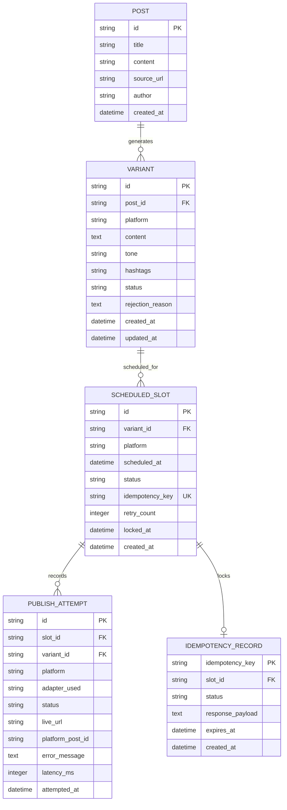

# System Design: Social Media Studio (FlyRank Capstone)

## 1. Problem Statement
Content marketing workflows require taking a single canonical blog post and transforming it into multiple platform-specific variants (e.g., X, LinkedIn, Instagram, Telegram, Discord). Each social network has strict, divergent constraints regarding character limits, formatting styles, hashtag counts, and tones.

In real-world production, naive publishing scripts fail because:
1. **Accidental Duplicate Publishing**: Network timeouts or worker retries trigger duplicate posts to public feeds.
2. **Unenforced Platform Constraints**: Malformed content that exceeds length or hashtag limits is submitted, causing platform rejection or broken public formatting.
3. **Unreviewed Publication**: Draft or unvetted AI-generated content escapes into production without human approval.
4. **Worker Crashes Mid-Batch**: When a scheduler process crashes halfway through a multi-platform release, it loses state or republishes already posted items upon restart.
5. **Coupled Vendor APIs**: Business logic tightly bound to specific platform SDKs requires full codebase rewrites when adding or modifying targets.

**Social Media Studio** solves this with a reliable, idempotent multi-platform campaign engine featuring a single source-of-truth ingestion model, strict programmatic constraint enforcement, human-in-the-loop review gating, a pluggable adapter seam, and durable crash-resilient job scheduling.

---

## 2. Platform Constraint Profiles

Every platform enforces strict programmatic rules. Violations reject content immediately before human review.

| Platform | Max Chars | Min Chars | Hashtag Rules | Allowed Tone | Special Rules |
| :--- | :--- | :--- | :--- | :--- | :--- |
| **X (Twitter)** | 280 | 10 | 1 to 3 hashtags | Punchy, concise, high-impact | URL auto-counted, no markdown tables |
| **LinkedIn** | 3000 | 80 | 2 to 5 hashtags | Professional, thought-leadership | Paragraph breaks, clear key takeaways |
| **Instagram** | 2200 | 20 | 5 to 15 hashtags | Visual caption, engaging, conversational | Hashtags clustered, emoji-friendly |
| **Telegram** | 4096 | 10 | 0 to 5 hashtags | Direct, informative, community-focused | Markdown/HTML formatting supported |
| **Discord** | 2000 | 5 | 0 to 3 hashtags | Casual, community-oriented | Webhook embed or markdown text |

### Rule Validation Schema
```typescript
export interface ConstraintProfile {
  platform: 'x' | 'linkedin' | 'instagram' | 'telegram' | 'discord';
  maxCharacters: number;
  minCharacters: number;
  minHashtags: number;
  maxHashtags: number;
  allowedTones: string[];
  forbiddenPhrases?: string[];
}

export interface ConstraintValidationResult {
  valid: boolean;
  errors: string[];
  metrics: {
    characterCount: number;
    maxCharacters: number;
    hashtagCount: number;
    hashtagsFound: string[];
    detectedTone: string;
  };
}
```

---

## 3. Data Model

The database uses SQLite in WAL (Write-Ahead Logging) mode for durability, fast atomic transactions, and zero external infrastructure requirements.



---

## 4. The Adapter Seam (SocialPublisher Interface)

The core domain relies solely on the polymorphic `SocialPublisher` abstraction. Business logic has zero knowledge of Discord, Telegram, or Twitter SDK details.

```typescript
export interface PublishPayload {
  variantId: string;
  slotId: string;
  platform: string;
  content: string;
  hashtags: string[];
  idempotencyKey: string;
  metadata?: Record<string, any>;
}

export interface PublishResult {
  success: boolean;
  platformPostId: string;
  postUrl: string;
  adapterName: string;
  timestamp: string;
  rawResponse?: Record<string, any>;
}

export interface PreviewResult {
  renderedText: string;
  characterCount: number;
  formattedPreviewHtml: string;
  platform: string;
}

export interface SocialPublisher {
  readonly platformName: string;
  readonly isMock: boolean;
  
  publish(payload: PublishPayload): Promise<PublishResult>;
  preview(payload: PublishPayload): Promise<PreviewResult>;
  validate(payload: PublishPayload): ConstraintValidationResult;
}
```

### Adapter Implementations:
1. **`TelegramPublisher`** (Real $0 Target): Uses Telegram Bot API (`sendMessage`) to publish to a dedicated Telegram channel/group.
2. **`DiscordPublisher`** (Real $0 Target): Uses Discord Webhooks (`POST /api/webhooks/...`) to publish formatted markdown embeds to a Discord channel.
3. **`MockXPublisher`** (Mock Target): Simulates X/Twitter v2 Tweets endpoint, records simulation data to the local database, and validates the 280-character ceiling.
4. **`MockLinkedInPublisher`** (Mock Target): Simulates LinkedIn UGC Posts API, formats professional paragraphs, and stores preview payloads.
5. **`PublisherFactory`**: Routes publish requests based on system configuration or per-campaign overrides without touching publishing or review business logic.

---

## 5. API Surface Specification

| Method | Path | Description | Status Codes |
| :--- | :--- | :--- | :--- |
| `POST` | `/api/posts/ingest` | Ingest blog post via URL or Markdown | `201 Created`, `400 Bad Request` |
| `GET` | `/api/posts` | List all ingested posts | `200 OK` |
| `GET` | `/api/posts/:id` | Retrieve single canonical post | `200 OK`, `404 Not Found` |
| `POST` | `/api/posts/:id/generate` | Generate variants for target platforms | `200 OK`, `422 Unprocessable Entity` |
| `GET` | `/api/variants` | List variants (filterable by status/post) | `200 OK` |
| `POST` | `/api/variants/validate` | Validate arbitrary variant content against constraints | `200 OK` (with valid boolean & error list) |
| `POST` | `/api/variants/:id/approve` | Transition variant from `draft` -> `approved` | `200 OK`, `404 Not Found` |
| `POST` | `/api/variants/:id/reject` | Transition variant to `rejected` with reason | `200 OK`, `404 Not Found` |
| `PUT` | `/api/variants/:id` | Edit variant text & auto-revalidate constraints | `200 OK`, `422 Unprocessable Entity` |
| `POST` | `/api/scheduler/schedule` | Schedule an approved variant for publication | `201 Created`, `400/422 Bad Request (if unapproved)` |
| `GET` | `/api/scheduler/slots` | List all scheduled time slots & statuses | `200 OK` |
| `POST` | `/api/scheduler/dispatch-now` | Immediately trigger worker loop for due jobs | `200 OK` |
| `GET` | `/api/history` | Retrieve full publish attempt history | `200 OK` |
| `GET` | `/api/adapters` | Get registered adapters and active configuration | `200 OK` |
| `POST` | `/api/adapters/swap` | Dynamically switch active default adapter | `200 OK` |
| `POST` | `/api/probes/run-all` | Run automated Acceptance Probes 1-6 | `200 OK` (probe test telemetry) |

---

## 6. Durable Scheduling & Mid-Batch Recovery

1. **Persistent Job Store**: All scheduled slots reside in SQLite with state `PENDING`, `PROCESSING`, `COMPLETED`, `FAILED`.
2. **Atomic Job Claiming**: The worker atomically queries and locks due slots using SQL transactions.
3. **Idempotency Guard**: Before dispatching to any adapter, the system checks `idempotency_keys`. If the key is already `COMPLETED`, the job is marked completed with the existing receipt and no duplicate post is sent.
4. **Crash Recovery**: If a worker process abruptly dies mid-batch:
   - Jobs already published are marked `COMPLETED` in SQLite transactionally.
   - Jobs that were in-flight have expired lock leases and are safely picked up on restart.
   - The idempotency layer ensures that even if a job was halfway through, duplicate network calls are completely prevented.

---

## 7. Explicit Non-Goals
To maintain hyper-focus on backend architectural resilience, idempotency, and adapter decoupling, the following are **explicitly out of scope**:
- Automated AI Image Generation (DALL-E / Midjourney).
- Live OAuth 2.0 flows for paid/restricted enterprise APIs (e.g. Paid Twitter Enterprise API, LinkedIn Partner API, Meta Graph API for Instagram).
- Post-publish social analytics, impressions, follower tracking, and engagement metrics.
- Billing, subscription tiers, and payment gateways.
